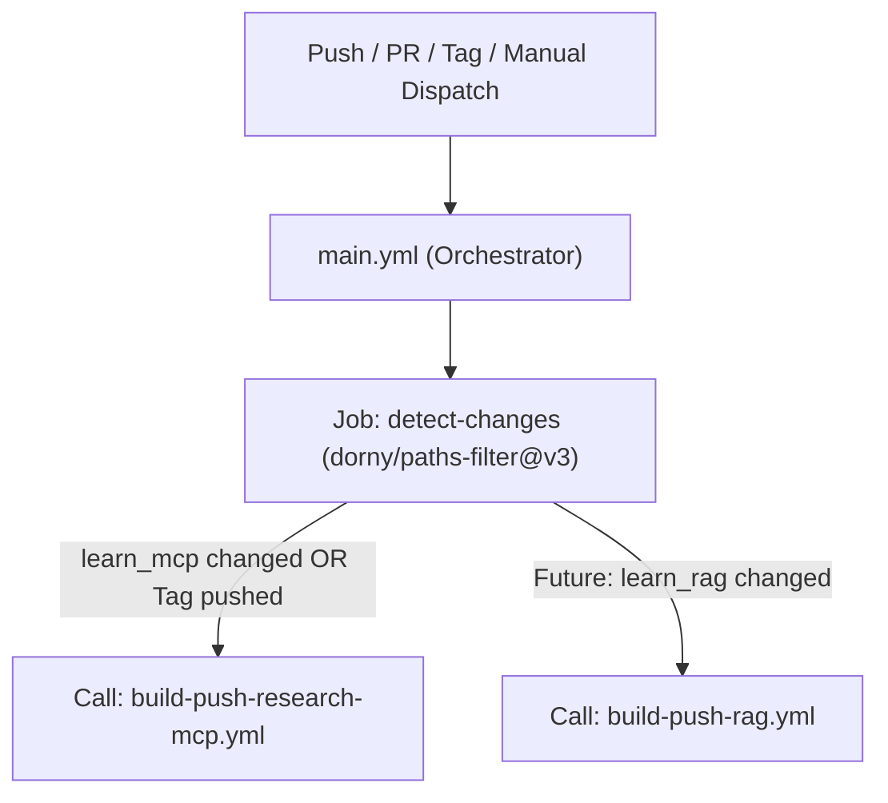

# 🧠 Learn AI: Hands-on AI, LLMs & Model Context Protocol (MCP) Projects

A comprehensive collection of practical projects exploring **Artificial Intelligence (AI)**, **Large Language Models (LLMs)**, **Agentic Architectures**, and the **Model Context Protocol (MCP)**.

---

## 📚 Repository Overview

| Module / Project | Description | Key Technologies |
| :--- | :--- | :--- |
| **[`learn_mcp/`](./learn_mcp)** | Research assistant chatbot combining **FastMCP** server with Langchain to search and analyze arXiv scientific papers in real-time. | Model Context Protocol (MCP), Langchain, FastMCP, arXiv API, `uv` |

---

## 🚀 Getting Started

To explore the projects, navigate to any specific project directory and follow its dedicated `README.md`.
---

# CI/CD flow

## 📄 License

MIT License
