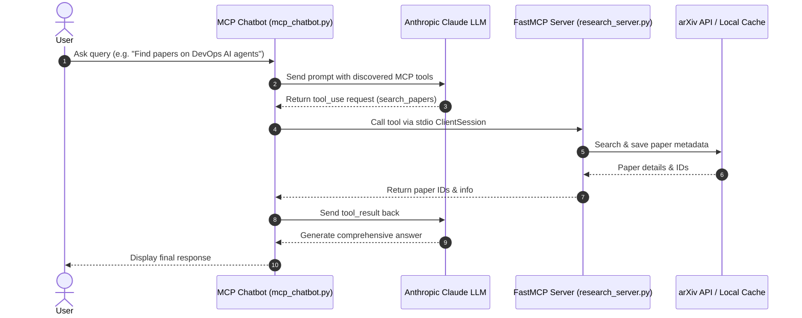

# 🤖 Learn MCP: AI LLM & Model Context Protocol (MCP) Research Assistant

An AI and Large Language Model (LLM) project demonstrating how to build autonomous agentic workflows using the **Model Context Protocol (MCP)** with **Anthropic Claude 3.7 Sonnet** and **FastMCP**.

---

## 📌 Overview

This project showcases the integration of modern AI LLM capabilities with the **Model Context Protocol (MCP)** standard. It connects an interactive Claude-powered AI chatbot with a custom FastMCP server capable of searching scientific literature on arXiv, extracting paper metadata, and providing informed answers via real-time tool execution.

### Key Concepts Covered
- **AI & Large Language Models (LLMs)**: Multi-turn tool calling, structured tool use, and reasoning with Claude (`claude-3-7-sonnet-20250219`).
- **Model Context Protocol (MCP)**: Standardized communication between LLMs and external tools/data sources using `FastMCP` and standard I/O (`stdio`) transport.
- **Agentic Tool Loop**: Dynamic tool discovery via `session.list_tools()`, automated execution via `session.call_tool()`, and feeding tool results back to the LLM.
- **Academic Research Tooling**: Live paper queries and paper information caching using the `arxiv` API.

---

## 🏗️ Architecture & Workflow



---

## ✨ Features

- **FastMCP Research Server (`research_server.py`)**:
  - `search_papers`: Queries arXiv for relevant papers by topic, saves structured metadata (`title`, `authors`, `summary`, `pdf_url`, `published`) locally to `papers/<topic>/papers_info.json`.
  - `extract_info`: Retrieves cached information for any specific paper ID across topic directories.
- **Interactive MCP Chatbot (`mcp_chatbot.py`)**:
  - Spawns the MCP server subprocess via `uv run research_server.py` over `stdio`.
  - Dynamically initializes the session and translates MCP tool schemas into Anthropic tool definitions.
  - Handles the iterative tool execution loop seamlessly until the final text response is produced.
- **MCP Inspector Support**:
  - Compatible with `@modelcontextprotocol/inspector` for visual debugging and manual tool testing.

---

## 📁 Project Structure

```text
learn_mcp/
├── .env.example          # Environment variables template
├── .gitignore            # Git ignore rules for Python, virtualenv, and cache
├── main.py               # Entry point placeholder
├── mcp_chatbot.py        # MCP Client & interactive Anthropic Claude chatbot
├── pyproject.toml        # Project metadata and dependencies (managed by uv)
├── README.md             # Project documentation
├── research_server.py    # FastMCP research server exposing arXiv tools
├── uv.lock               # Lockfile for reproducible dependencies
└── papers/               # Local cache for retrieved paper info (git ignored)
```

---

## 🚀 Getting Started

### Prerequisites
- **Python 3.12+**
- [uv](https://docs.astral.sh/uv/) (recommended package manager)
- **Anthropic API Key** (get one from [Anthropic Console](https://console.anthropic.com/))
- **Node.js** (optional, for running the MCP Inspector)

### 1. Installation

Clone the repository and install dependencies using `uv`:

```bash
cd learn_mcp
uv sync
```

### 2. Environment Configuration

Create your `.env` file from the template and set your API key:

```bash
cp .env.example .env
```

Edit `.env`:
```env
ANTHROPIC_API_KEY=your_anthropic_api_key_here
```

---

## 💻 Usage

### Option A: Run the Interactive MCP Chatbot

Launch the full agentic chatbot:

```bash
uv run mcp_chatbot.py
```

Example interactions:
```text
MCP Chatbot Started!
Type your queries or 'quit' to exit.

Query: Find 3 recent research papers on multi-agent systems and summarize their key findings.

Calling tool search_papers with args {'topic': 'multi-agent systems', 'max_results': 3}
Results are saved in: papers/multi-agent_systems/papers_info.json
Calling tool extract_info with args {'paper_id': '2401.xxxxx'}
...
[Claude generates detailed summaries with direct PDF links and publication dates]
```

### Option B: Test with MCP Inspector

Inspect tools, schemas, and test execution through the interactive MCP Inspector UI:

```bash
npx @modelcontextprotocol/inspector uv run research_server.py
```

Open the displayed browser URL (usually `http://localhost:5173` or similar) to interact directly with the `search_papers` and `extract_info` tools.

---

## 🛠️ Built With

- **[Model Context Protocol (MCP)](https://modelcontextprotocol.io/)** - Open standard for secure AI tool integration
- **[Anthropic Claude Python SDK](https://github.com/anthropics/anthropic-sdk-python)** - Claude 3.7 Sonnet LLM client
- **[FastMCP](https://github.com/modelcontextprotocol/python-sdk)** - High-level Python framework for building MCP servers
- **[arXiv Python](https://github.com/lukasschwab/arxiv.py)** - Wrapper for arXiv API
- **[uv](https://astral.sh/uv)** - Fast Python package manager

---

## 📄 License

This project is open source and available under the MIT License.
