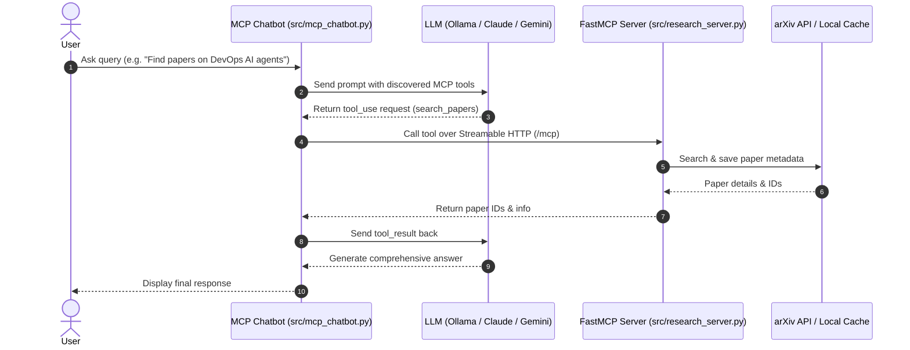

# 🤖 Learn MCP: AI LLM & Model Context Protocol (MCP) Research Assistant

An AI and Large Language Model (LLM) project demonstrating how to build autonomous agentic workflows using the **Model Context Protocol (MCP)** with **LangChain** (supporting Ollama, Claude, and Gemini) and **FastMCP**.

---

## 📌 Overview

This project showcases the integration of modern AI LLM capabilities with the **Model Context Protocol (MCP)** standard. It connects an interactive LangChain-powered AI chatbot with a custom FastMCP server capable of searching scientific literature on arXiv, extracting paper metadata, and providing informed answers via real-time tool execution.

### Key Concepts Covered
- **AI & Large Language Models (LLMs)**: Multi-turn tool calling, structured tool use, and reasoning across providers (`ollama`, `anthropic`, `google_genai`) via LangChain.
- **Model Context Protocol (MCP)**: Standardized communication between LLMs and external tools/data sources using `FastMCP` over Streamable HTTP (`/mcp`) and `stdio`.
- **Agentic Tool Loop**: Dynamic tool discovery via `MultiServerMCPClient`, automated execution, and feeding tool results back into the agent loop.
- **Academic Research Tooling**: Live paper queries and paper information caching using the `arxiv` API.

---

## 🏗️ Architecture & Workflow



---

## ✨ Features

- **FastMCP Research Server (`src/research_server.py`)**:
  - `search_papers`: Queries arXiv for relevant papers by topic, saves structured metadata (`title`, `authors`, `summary`, `pdf_url`, `published`) locally to `papers/<topic>/papers_info.json`.
  - `extract_info`: Retrieves cached information for any specific paper ID across topic directories.
  - Exposes Streamable HTTP endpoint on `http://0.0.0.0:8080/mcp`.
- **Interactive MCP Chatbot (`src/mcp_chatbot.py`)**:
  - Connects to multi-server configurations in `server_config.json` via Streamable HTTP and stdio.
  - Dynamically builds a LangChain tool-calling agent using the configured LLM provider.
  - Handles the iterative tool execution loop seamlessly until the final text response is produced.
- **MCP Inspector Support**:
  - Compatible with `@modelcontextprotocol/inspector` for visual debugging, tool schema inspection, and manual execution.

---

## 📁 Project Structure

```text
learn_mcp/
├── .claude/
│   └── settings.local.json   # Local permissions configuration
├── .env.example              # Environment variables template
├── .gitignore                # Git ignore rules for Python, virtualenv, and cache
├── docker/
│   ├── Dockerfile.dev        # Development container setup
│   ├── Dockerfile.prod       # Multi-stage hardened production container
│   └── docker-compose.yml    # Compose configuration for local containerized dev
├── src/
│   ├── __init__.py           # Package marker
│   ├── llm_provider.py       # LLM provider configuration helper
│   ├── mcp_chatbot.py        # MCP Client & interactive agentic chatbot
│   └── research_server.py    # FastMCP research server exposing arXiv tools
├── papers/                   # Local cache for retrieved paper info (git ignored)
├── pyproject.toml            # Project metadata and dependencies (managed by uv)
├── README.md                 # Project documentation
├── server_config.json        # MCP server registry configuration for chatbot
├── summary.md                # Summary documentation
└── uv.lock                   # Lockfile for reproducible dependencies
```

---

## 🚀 Getting Started

### Prerequisites
- **Python 3.12+** & **[uv](https://docs.astral.sh/uv/)**
- **LLM Access**: Local [Ollama](https://ollama.com/) (default) or an API key (`ANTHROPIC_API_KEY` / `GOOGLE_API_KEY`)
- **Node.js** *(optional, for MCP Inspector)*
- **Docker** *(optional, for containerized deployment)*

### 1. Setup

```bash
# Clone & navigate to the project
cd learn_mcp

# Install dependencies
uv sync

# Configure environment variables
cp .env.example .env
```

Configure your LLM provider in `.env` (supports `ollama`, `anthropic`, or `google_genai`):
```env
LLM_PROVIDER=ollama
LLM_MODEL=llama3.1
# OLLAMA_BASE_URL=http://localhost:11434
# ANTHROPIC_API_KEY=your_key_here
# GOOGLE_API_KEY=your_key_here
```

---

## 🌐 Live Deployed Server

A live production instance of the Research MCP Server is hosted and publicly accessible:
* **Endpoint URL**: [`https://research-mcp-sha-a64029e.onrender.com/mcp`](https://research-mcp-sha-a64029e.onrender.com/mcp)
* **Transport**: Streamable HTTP / HTTP POST

You can connect to this live server immediately using the MCP Inspector or the Chatbot client without hosting the server locally.

---

## 💻 Usage

### Option A: Test with the Live Deployed Server (No Local Setup Required)

#### 1. Test via MCP Inspector Web UI
1. Launch the inspector:
   ```bash
   npx @modelcontextprotocol/inspector
   ```
2. In the Inspector UI:
   - **Transport Type**: Select `Streamable HTTP` (or `HTTP`)
   - **URL**: `https://research-mcp-sha-a64029e.onrender.com/mcp`
   - Click **Connect** to immediately query tools, test schemas, and inspect resources live.

#### 2. Connect the Chatbot to the Live Server
Update [`server_config.json`](file:///Users/nosakharedanielahanor/Developer/private_project/learn_ai/learn_mcp/server_config.json) to point to the live URL:
```json
"research": {
    "url": "https://research-mcp-sha-a64029e.onrender.com/mcp",
    "transport": "http"
}
```
Then launch the chatbot:
```bash
uv run src/mcp_chatbot.py
```

---

### Option B: Run the Server Locally

#### 1. Start the Local FastMCP Research Server
Run directly with `uv`:
```bash
uv run src/research_server.py
```
*Or run inside a Docker container:*
```bash
docker compose -f docker/docker-compose.yml up -d
```

#### 2. Connect the Chatbot to Local Server
Ensure [`server_config.json`](file:///Users/nosakharedanielahanor/Developer/private_project/learn_ai/learn_mcp/server_config.json) points to localhost:
```json
"research": {
    "url": "http://localhost:8080/mcp",
    "transport": "http"
}
```
Run the chatbot:
```bash
uv run src/mcp_chatbot.py
```

#### 3. Test Local Server with MCP Inspector
```bash
npx @modelcontextprotocol/inspector
```
Connect to `http://localhost:8080/mcp` in the Inspector UI.

---

## 🔌 Connecting to Claude, Cursor & Other AI Clients

You can connect the live research MCP server to any MCP-compliant AI assistant or IDE:

### 1. Anthropic Claude Desktop
The easiest way to configure Claude Desktop:
1. In Claude Desktop, go to **Settings > Developer**.
2. Click the **Edit Config** button to open `claude_desktop_config.json`.
3. Add the live server entry (using `mcp-remote` as a bridge):

```json
{
  "mcpServers": {
    "research-mcp": {
      "command": "npx",
      "args": [
        "-y",
        "mcp-remote",
        "https://research-mcp-sha-a64029e.onrender.com/mcp"
      ]
    }
  }
}
```
> **Note:** Restart Claude Desktop after saving. You will see a 🔨 tools icon with `search_papers` and `extract_info` ready to query scientific research papers!

### 2. Cursor / Windsurf / VS Code (Cline & Roo Code)
In your IDE's MCP Settings (or `.cursor/mcp.json`):
```json
{
  "mcpServers": {
    "research-mcp": {
      "url": "https://research-mcp-sha-a64029e.onrender.com/mcp"
    }
  }
}
```

### 3. ChatGPT & Web UIs (LibreChat, OpenWebUI, Dify)
In any MCP-compatible web client or gateway, register the remote server:
* **Server Type**: `Streamable HTTP` / `HTTP`
* **URL**: `https://research-mcp-sha-a64029e.onrender.com/mcp`


---

## 🛠️ Built With

- **[Model Context Protocol (MCP)](https://modelcontextprotocol.io/)** - Open standard for secure AI tool integration
- **[Langchain](https://www.langchain.com)** - Langchain for MCP client implementation 
- **[FastMCP](https://github.com/modelcontextprotocol/python-sdk)** - High-level Python framework for building MCP servers
- **[arXiv Python](https://github.com/lukasschwab/arxiv.py)** - Wrapper for arXiv API
- **[uv](https://astral.sh/uv)** - Fast Python package manager

---

## 📄 License

This project is open source and available under the MIT License.
